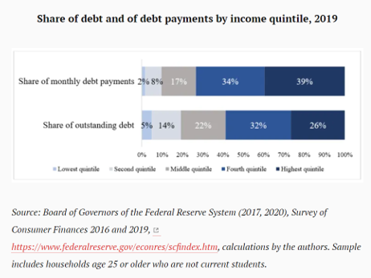
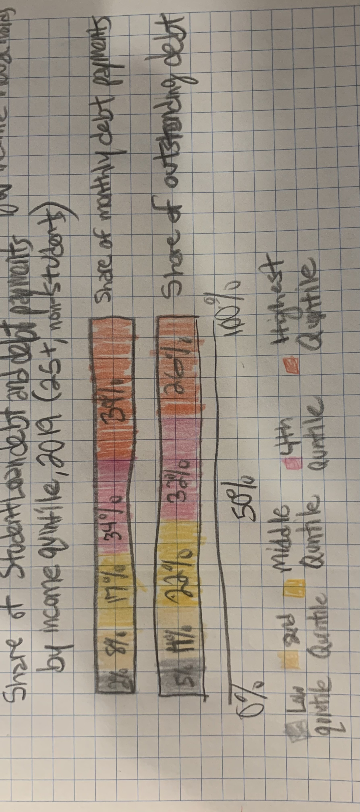
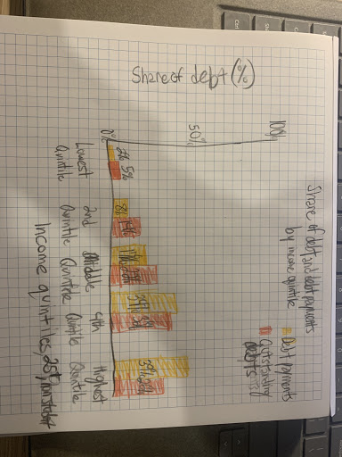

# Original Visualization

I selected this data visualization because I am interested in the student loan crisis in the United States and this data was presented in a recently published article by Brookings where they overviewed new data on the share of student loan debt held by Americans. The chart I selected is showing data on the total share of debt and the monthly payments made by student loan borrowers based on their income quintile. Having access to this data and presenting it in a clear way will aid in advocating for student loan reform policy.

# Wireframes
## First Wireframe

## Second Wireframe

## My Process
My process for redesigning this data included opening up the source data file on the Fed site to better understand it and see if I could use it directly for my redesign. This was a large csv file with many sheets making it difficult to tell how the data was aggregated to make a new visualization. I decided to use the data as its presented in the original instead and consider the audience and the key takeaways. I determined those were to show the comparison between each income quintiles share of the outstanding debt and their share of the monthly payments.

For my first wireframe I recreated the visualization and only changed the color scheme and x-axis count. I think the color change made the visualization more appealing to look at, but did not significantly improve how the chart was interpreted.

For my second wireframe I flipped the chart and turned it into side-by-side bar charts grouped by income quintile. This allows for clearer comparison of the share of outstanding debt and monthly debt spending within the income groups. Then we can see more clearly which groups have the largest total share and how it compares to their spending and to others.

When showing the wireframes to others the major feedback I got was positive. Most were clear on the intended audience and the key takeaways. One stated, "the audience could be to people around my age getting ready to head into college, people in college, and people who have just left or graduated college" which affirmed my idea of who the intended audience was.

The major critiques I received were to change the colors used for more contrast and the labels were not clear enough, which I took into consideration when recreating my final visualization in Flourish.

# Final Data Visualization
[Final Viz](<iframe src='https://flo.uri.sh/visualisation/4400562/embed' title='Interactive or visual content' frameborder='0' scrolling='no' style='width:100%;height:600px;'></iframe>

)
